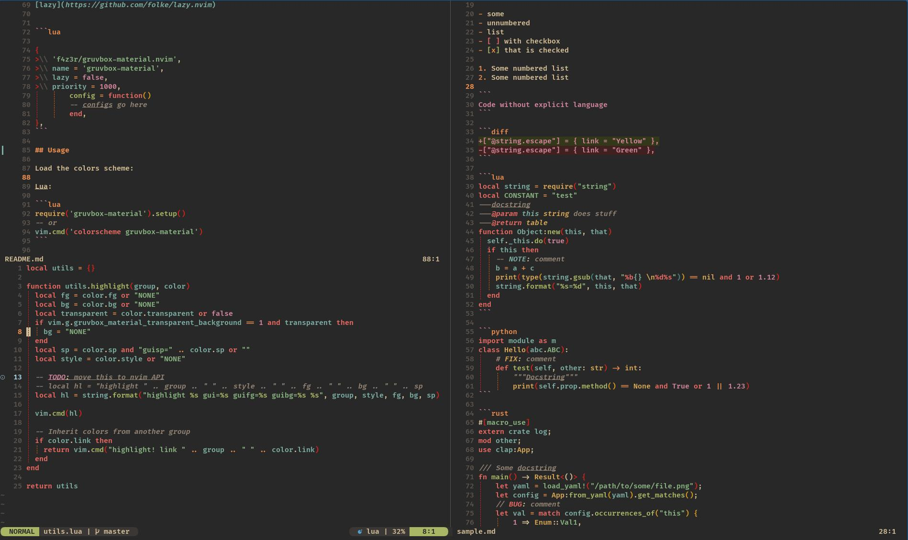
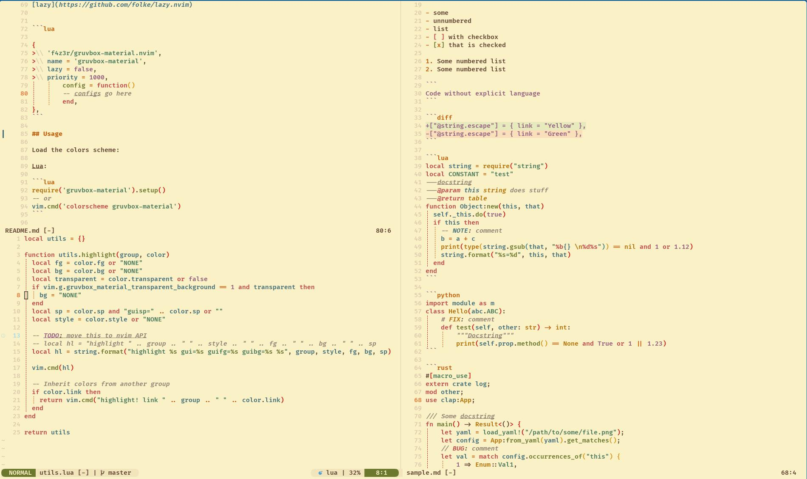

# Gruvbox Material Scheme

> [!NOTE]
> This is a continuation of the original work from WittyJudge:
> https://github.com/WIttyJudge/gruvbox-material.nvim

A port of [gruvbox-material](https://github.com/sainnhe/gruvbox-material) colorscheme for Neovim
written in Lua. It does not aim to be 100% compatible with the mentioned repository, but rather
focuses on keeping the existing scheme stable and to support popular plugins. This colorscheme 
supports both `dark` and `light` themes, based on configured background.

**Dark theme:**


**Light theme:**


---

**Table of Contents:**

<!--toc:start-->
- [Gruvbox Material Scheme](#gruvbox-material-scheme)
  - [Features](#features)
  - [Installation](#installation)
  - [Usage](#usage)
  - [Configuration](#configuration)
<!--toc:end-->

---

## Features

- Supported Plugins:
  - [Treesitter](https://github.com/nvim-treesitter/nvim-treesitter)
  - [Telescope](https://github.com/nvim-telescope/telescope.nvim)
  - [LSP Diagnostics](https://neovim.io/doc/user/lsp.html)
  - [Nvim Tree](https://github.com/kyazdani42/nvim-tree.lua)
  - [NERDTree](https://github.com/preservim/nerdtree)
  - [Startify](https://github.com/mhinz/vim-startify)
  - [vim-gitgutter](https://github.com/airblade/vim-gitgutter)
  - [undotree](https://github.com/mbbill/undotree)
  - [Vista.vim](https://github.com/liuchengxu/vista.vim)
  - [Hop](https://github.com/phaazon/hop.nvim)
  - [WhichKey](https://github.com/liuchengxu/vim-which-key)
  - [indentLine](https://github.com/Yggdroot/indentLine)
  - [Indent Blankline](https://github.com/lukas-reineke/indent-blankline.nvim)
  - And many other plugins you can find [here](./lua/gruvbox-material/highlights.lua#L384)

Please feel free to open an issue if you want some features or other plugins to be included.

## Installation

> [!NOTE]
> This plugin requires Neovim >= 0.5.0

Install via your favourite package manager:

[vim-plug](https://github.com/junegunn/vim-plug)

```vim
Plug 'f4z3r/gruvbox-material.nvim'
```

[packer](https://github.com/wbthomason/packer.nvim)

```lua
use 'f4z3r/gruvbox-material.nvim'
```

[lazy](https://github.com/folke/lazy.nvim)


```lua

{
	'f4z3r/gruvbox-material.nvim',
	name = 'gruvbox-material',
	lazy = false,
	priority = 1000,
        config = function()
        -- configs go here
        end,
},
```

## Usage

Load the colors scheme:

Lua:

```lua
require('gruvbox-material').setup()
-- or
vim.cmd('colorscheme gruvbox-material')
```

Vim script:

```vim
colorscheme gruvbox-material
```

## Configuration

> [!IMPORTANT]
> The configuration needs to be set **before** loading the color scheme. How the configuration is
> set is likely to change in the future to support setting values via the `setup()` function.

This is an example of the function with the default values.

| Option                                  | Default | Description                 |
| --------------------------------------- | ------- | --------------------------- |
| gruvbox_material_enable_italic_comment  | `1`     | Make comments italic        |
| gruvbox_material_transparent_background | `0`     | Make background transparent |

Lua:

```lua
vim.g.gruvbox_material_enable_italic_comment = 1
vim.g.gruvbox_material_transparent_background = 0
```

Vim script:

```vim
let g:gruvbox_material_enable_italic_comment = 1
let g:gruvbox_material_transparent_background = 0
```
