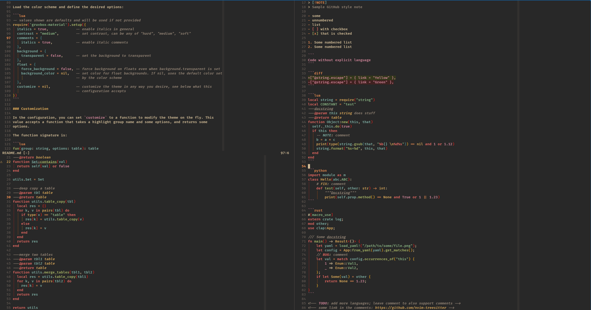
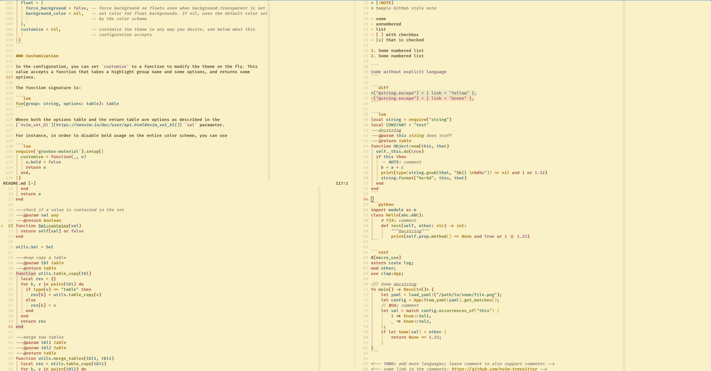
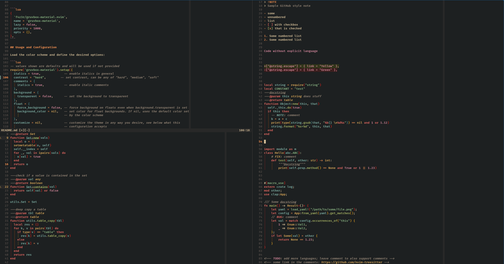
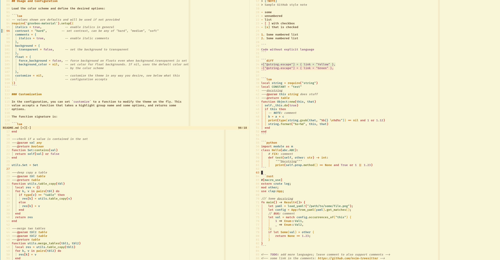
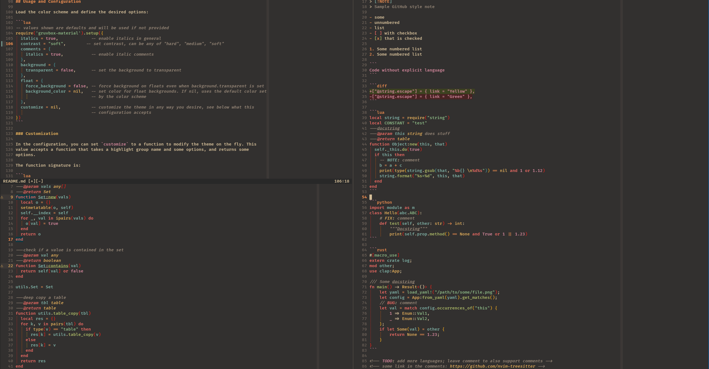
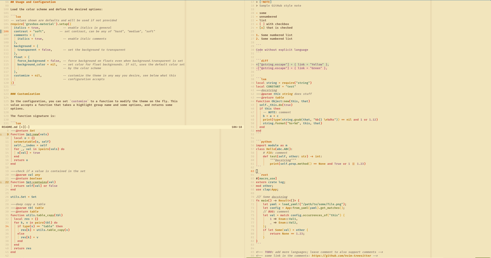

# Gruvbox Material Scheme

> [!NOTE]
> This is a continuation of the original work from WittyJudge:
> https://github.com/WIttyJudge/gruvbox-material.nvim

A port of [gruvbox-material](https://github.com/sainnhe/gruvbox-material) colorscheme for Neovim
written in Lua. It does not aim to be 100% compatible with the mentioned repository, but rather
focuses on keeping the existing scheme stable and to support popular plugins. This colorscheme
supports both `dark` and `light` themes, based on configured background, and harder or softer
contrasts.

**Dark theme:**


**Light theme:**


<details>
    <summary>Different contrasts</summary>

| Contrast |             Dark              |             Light              |
|  :---:   |            :----:             |             :----:             |
|   Hard   |    |    |
|  Medium  |  |  |
|   Soft   |    |    |

</details>

---

**Table of Contents:**

<!--toc:start-->
- [Gruvbox Material Scheme](#gruvbox-material-scheme)
  - [Features](#features)
  - [Installation](#installation)
  - [Usage and Configuration](#usage-and-configuration)
    - [Customization](#customization)
<!--toc:end-->

---

## Features

- Supported Plugins:
  - [Treesitter](https://github.com/nvim-treesitter/nvim-treesitter)
  - [Telescope](https://github.com/nvim-telescope/telescope.nvim)
  - [LSP Diagnostics](https://neovim.io/doc/user/lsp.html)
  - [Nvim Tree](https://github.com/kyazdani42/nvim-tree.lua)
  - [NERDTree](https://github.com/preservim/nerdtree)
  - [Startify](https://github.com/mhinz/vim-startify)
  - [vim-gitgutter](https://github.com/airblade/vim-gitgutter)
  - [undotree](https://github.com/mbbill/undotree)
  - [Vista.vim](https://github.com/liuchengxu/vista.vim)
  - [Hop](https://github.com/phaazon/hop.nvim)
  - [WhichKey](https://github.com/liuchengxu/vim-which-key)
  - [indentLine](https://github.com/Yggdroot/indentLine)
  - [Indent Blankline](https://github.com/lukas-reineke/indent-blankline.nvim)
  - [nvim-notify](https://github.com/rcarriga/nvim-notify)
  - [vim-illuminate](https://github.com/RRethy/vim-illuminate)
  - [nvim-cmp](https://github.com/hrsh7th/nvim-cmp)
  - [neorg](https://github.com/nvim-neorg/neorg)
  - [headlines.nvim](https://github.com/lukas-reineke/headlines.nvim/)
  - And many other plugins you can find [here](./lua/gruvbox-material/highlights.lua#L384)

Please feel free to open an issue if you want some features or other plugins to be included.

## Installation

> [!NOTE]
> This plugin requires Neovim >= 0.5.0

Install via your favourite package manager:

[vim-plug](https://github.com/junegunn/vim-plug)

```vim
Plug 'f4z3r/gruvbox-material.nvim'
```

[packer](https://github.com/wbthomason/packer.nvim)

```lua
use 'f4z3r/gruvbox-material.nvim'
```

[lazy](https://github.com/folke/lazy.nvim)


```lua
{
  'f4z3r/gruvbox-material.nvim',
  name = 'gruvbox-material',
  lazy = false,
  priority = 1000,
  opts = {},
},
```

## Usage and Configuration

Load the color scheme and define the desired options:

```lua
-- values shown are defaults and will be used if not provided
require('gruvbox-material').setup({
  italics = true,             -- enable italics in general
  contrast = "medium",        -- set contrast, can be any of "hard", "medium", "soft"
  comments = {
    italics = true,           -- enable italic comments
  },
  background = {
    transparent = false,      -- set the background to transparent
  },
  float = {
    force_background = false, -- force background on floats even when background.transparent is set
    background_color = nil,   -- set color for float backgrounds. If nil, uses the default color set
                              -- by the color scheme
  },
  signs = {
    highlight = true,         -- whether to highlight signs
  },
  customize = nil,            -- customize the theme in any way you desire, see below what this
                              -- configuration accepts
})
```

### Customization

In the configuration, you can set `customize` to a function to modify the theme on the fly. This
value accepts a function that takes a highlight group name and some options, and returns some
options.

The function signature is:

```lua
fun(group: string, options: table): table
```

Where both the options table and the return table are options as described in the
[`nvim_set_hl`](https://neovim.io/doc/user/api.html#nvim_set_hl()) `val` parameter.

For instance, in order to disable bold usage on the entire color scheme, you can use

```lua
require('gruvbox-material').setup({
  customize = function(_, o)
    o.bold = false
    return o
  end,
})
```

Or if you want to change the coloring from a specific highlight group, in this case set the current
line number to a bold orange instead of the default grey:

```lua
-- get colors from the colorscheme for current background and "medium" contrast
local colors = require("gruvbox-material.colors").get(vim.o.background, "medium")

require('gruvbox-material').setup({
  customize = function(g, o)
    if g == "CursorLineNr" then
      o.link = nil            -- wipe a potential link, which would take precedence over other
                              -- attributes
      o.fg = colors.orange    -- or use any color in "#rrggbb" hex format
      o.bold = true
    end
    return o
  end,
})
```
